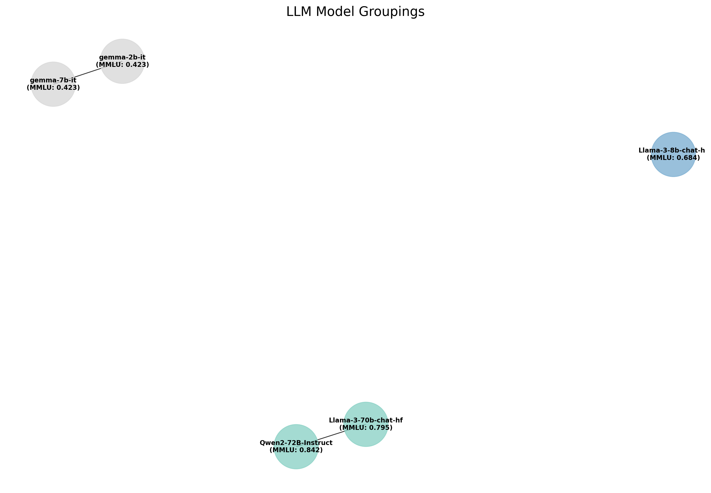

# HideNSeek
HideNSeek is a Model Fidelity Verification Algorithm for Probabilistically Fingerprinting LLMs

`algo_helpers/algo_helpers.py` currently has a working version of an early preview version of Hide-N-Sekk that utilizes a probablistic approach for idetnifying various LLMS



Sample Usage

Setup a YAML file that looks something like this: 
```
auditor_model: Qwen/Qwen2-72B-Instruct
test_models:
  - meta-llama/Llama-3-70b-chat-hf
  - meta-llama/Llama-3-8b-chat-hf
  - google/gemma-2-27b-it
  - mistralai/Mistral-7B-Instruct-v0.3
  - microsoft/phi-2
test_indexes:
  - 0
  - 1
  ```

To run the adverserial LLM test run the following command
```
python -m algo_helpers.adversarial_helpers --save_response --num_trials 10 --models_file models.yaml
```

### Algorithm

An LLM Is used to evaluate if various LLMS are similar or not

A Matrix can than be generated thats `M X M` that contains `1`'s where the models where confused for one another. A grouping algorithm can than visualize the groups and showcase what models are confused for which